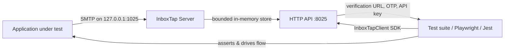

# InboxTap — Project Overview

Canonical, contributor-facing description of what InboxTap is, the problem it
solves, and the constraints it will not compromise on. User-facing guides and
API reference live on [inboxtap.dev/docs](https://inboxtap.dev/docs) (sources in
`web/content/docs/`); this document is for people changing the code.

## What it is

InboxTap is an open-source, local-only SMTP capture server and test SDK that
lets developers write deterministic automated tests for email-dependent flows —
signup verification, password resets, OTP codes, invitation links, API key
delivery — without relying on real mail services or fragile test fixtures.

## The problem it solves

Modern applications send emails at critical moments: account verification,
password resets, two-factor codes, team invitations. Testing these flows
end-to-end is painful because:

- Real SMTP services (SendGrid, Mailgun, and similar) are external, slow,
  rate-limited, and non-deterministic — unsuitable for CI/CD.
- Mocking email at the unit-test level misses the integration boundary where
  most bugs live: template rendering, link generation, SMTP delivery.
- Shared test mailboxes create race conditions in parallel test suites — one
  test reads another test's verification email.
- Existing tools (Mailhog, Mailpit) are Go binaries or Docker containers that
  add infrastructure overhead and do not provide a programmatic test SDK.

InboxTap solves this by running a tiny SMTP server on `127.0.0.1` that captures
every message in a bounded in-memory store and exposes it through a typed SDK
and HTTP API — so tests can assert on the exact email that was "sent."

## How it works

1. Start the server — `bunx inboxtap` or `npx inboxtap` (Node 20+).
2. Point the app under test at `127.0.0.1:1025` via environment variables.
3. In the test, create an isolated inbox with a unique address, trigger the
   email flow, then await the extracted value (link, code, pattern match).
4. No message leaves the machine. No auth, no TLS, no relay.

## Core components

| Module | Responsibility |
| --- | --- |
| `src/smtp.ts` | Wraps `smtp-server` with `AUTH`/`STARTTLS` disabled, enforces the max message size (SMTP 552 on overflow), and hands each inbound message to a capture callback. |
| `src/server.ts` | `InboxTapServer` composes the SMTP listener and HTTP API with the `127.0.0.1:1025`/`:8025` defaults (domain `local.test`, 100 messages, 5 MiB) and owns the start/stop lifecycle and `/health` payload. |
| `src/parser.ts` | Parses raw RFC 822 mail via `mailparser` into a `CapturedEmail`: normalized headers, text/HTML bodies, deduplicated http(s) links, unique 4–8 digit codes, and the raw source. |
| `src/store.ts` | In-memory `EmailStore` with FIFO eviction at `maxMessages`, filtered `list`/`latest`/`get`/`clear`, and long-poll waiters resolved on a matching add or cleaned up on timeout. |
| `src/api.ts` | Dependency-free `node:http` JSON handler for `/health` and `/api/emails` routes, validating filters and capping waits at 60 s and list limits at 100. |
| `src/client/` | The fetch-based test SDK: `InboxTapClient` plus `TestInbox` with `waitForMessage`/`waitForLink`/`waitForCode`/`waitForMatch` polling helpers and a typed `InboxTapError`. |
| `src/cli.ts` | Node/Bun executable that parses the CLI flags, starts `InboxTapServer`, prints connection info, and shuts down on `SIGINT`/`SIGTERM`. |
| `src/index.ts` | Public server entry point re-exporting `InboxTapServer` and the shared public types. |
| `src/types.ts` | Shared interfaces (`CapturedEmail`, `EmailFilters`, `HealthResponse`, …) imported by both server and client — the mechanism behind the SDK ↔ API alignment invariant. |

## Design invariants

These are hard constraints the project will not compromise on. Each one is
enforced in code today:

1. **Local-only** — binds to `127.0.0.1` by default; never an outbound relay.
   (`DEFAULT_OPTIONS` in `src/server.ts`; wider binding requires explicit
   `--smtp-host`/`--api-host` flags.)
2. **Capture, don't deliver** — no message is forwarded externally. The SMTP
   server disables `AUTH` and `STARTTLS` and only writes to the store
   (`src/smtp.ts`); the only mail dependencies are `smtp-server` and
   `mailparser` — there is no outbound SMTP client.
3. **Bounded resources** — memory, message sizes, wait times, and poll
   durations are all capped: 100-message FIFO store (`src/store.ts`), 5 MiB
   message limit (`src/smtp.ts`), 60,000 ms long-poll ceiling and list limit of
   100 (`src/api.ts`).
4. **Deterministic tests** — inbox addresses are generated in the client
   (`createInbox` in `src/client/index.ts`), so parallel tests isolate their
   messages without server-side registration; the API has no registration
   route at all.
5. **Dual-format output** — ships ESM, CJS, type declarations, and a compiled
   Node 20 CLI (`exports`/`bin` in `package.json`, `tsup.config.ts`, smoke-
   tested by `scripts/test-package.ts`).
6. **SDK ↔ API alignment** — HTTP response shapes and SDK return types stay in
   lockstep because both sides import the same `src/types.ts` definitions,
   backed by integration tests.

## Current scope (v0.1)

Included:

- In-memory bounded store with FIFO eviction
- CLI, HTTP API, and TypeScript SDK
- Server-side extraction of http(s) links and 4–8 digit codes; arbitrary
  regex matching is SDK-side via `waitForMatch` (and `waitForCode` defaults to
  6-digit codes)
- Long-poll support (up to 60 s timeout)
- Dual ESM/CJS package exports

Explicitly excluded:

- Persistence / database backing
- Web dashboard / UI for captured mail (the `web/` workspace is the static
  marketing and docs site for inboxtap.dev; it never talks to the API)
- Attachment handling
- Webhooks / event streaming
- Docker images
- Configurable extraction rules
- SMTP authentication or STARTTLS
- Outbound relay of any kind

## Target users

- QA and test engineers writing E2E tests (Playwright, Cypress) that involve
  email verification flows.
- Backend developers running integration test suites that trigger
  transactional emails.
- CI/CD pipelines that need a zero-config, zero-dependency SMTP capture
  solution.

## Distribution and toolchain

- Published as `inboxtap` on the public npm registry; runnable via
  `bunx inboxtap` or `npx inboxtap` with no install.
- Importable as a library: `import { InboxTapClient } from "inboxtap/client"`.
- Built with tsup; tested with Bun; formatted and linted with Biome;
  pre-commit/push hooks via Lefthook.

See [README.md](../README.md) for usage, [AGENTS.md](../AGENTS.md) for the
agent and contributor contract, [STYLE_GUIDE.md](../STYLE_GUIDE.md) for
engineering conventions, and [RELEASING.md](../RELEASING.md) for the release
flow.

**In one sentence:** InboxTap is a zero-config, local-only SMTP capture server
with a typed test SDK that makes email-dependent flows testable in
deterministic, parallel, CI-friendly automated tests.
